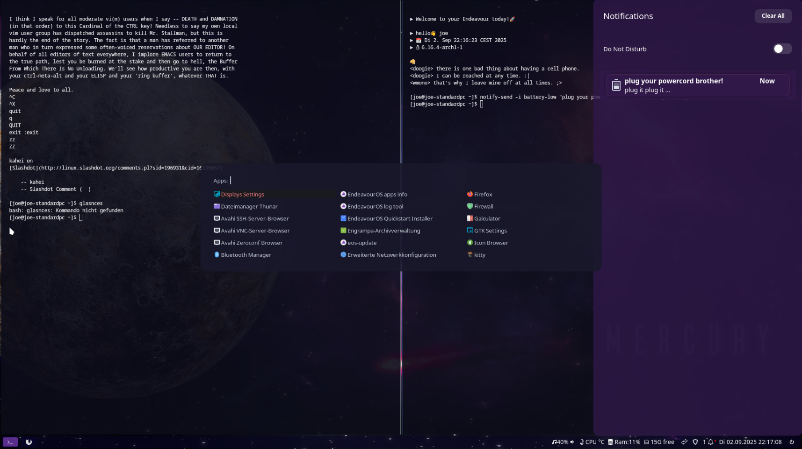

# EndeavourOS sway setup / dotfiles

sway setup for EndeavourOS based on the [i3 setup](https://github.com/endeavouros-team/endeavouros-i3wm-setup)


# It will include:
1. [waybar](https://github.com/Alexays/Waybar) with tray, powermenu, systemmonitors, worksapce buttons and audio control
2. [rofi-wayland](https://github.com/lbonn/rofi) for menues (Application menu and others)
3. [swaync](https://github.com/ErikReider/SwayNotificationCenter) notification, including swaync center for easy access to old notifications.
4. [sway tools](https://github.com/killajoe/sway_tools/tree/main)
5. [ly](github.com/fairyglade/ly) (as login manager)
6. start with using [kitty](https://sw.kovidgoyal.net/kitty/) terminal but may will fallback to foot
7. [nwg-look](https://github.com/nwg-piotr/nwg-look) and [nwg-displays](https://github.com/nwg-piotr/nwg-displays) for setup/change gtk theme and display settings. Awesome tools made by piotr: [nwg](https://nwg-piotr.github.io/nwg-shell/)
8. [thunar](https://docs.xfce.org/xfce/thunar/start) as filemanager, including setup to open kitty terminal in path, and filextractor
9. [bash](https://www.gnu.org/software/bash/bash.html) using a nice welcome message and fortune cookies enabled, plus history with up and down arrow buttons
10. [gtklock](https://github.com/jovanlanik/gtklock) as lock screen
11. [swayosd](https://github.com/ErikReider/SwayOSD) as OSD for volume brightness and others



# Things mostly working now but some parts still need some fixes/setup:
* workspace handling is still strange i will need to set a general basic usable no clue ;)
* keybindings are not generic too

**open weather:**

run `~/.config/sway/scripts/openweather -s` to create setup you will need:
1. Free API key from: https://openweathermap.org/api
2. city IDs from: https://openweathermap.org/find

Open waybar config and enable weather module by removing the commenting // there:

` nano ~/.config/waybar/config.jsonc`

```
"modules-center": [
    // "custom/weather"
    "custom/separator"
  ],
``` 


